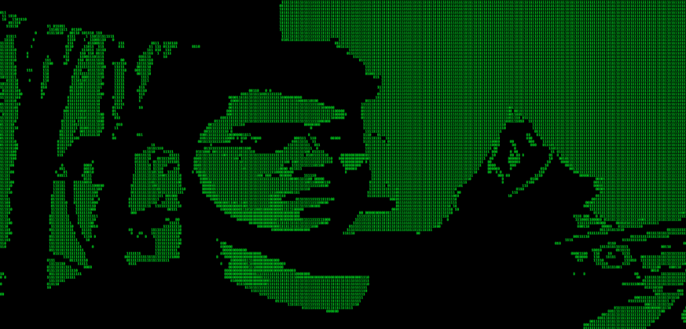
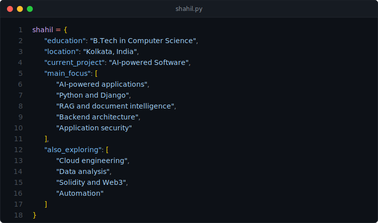

<!--
  GitHub Profile README
  Profile: github.com/ShahilRoy
-->

 

# Shahil Roy

### Engineering Student · AI Builder · Python & Django Developer

Building practical AI systems for document intelligence, legal research, automation and secure software.

---

## About Me

I am a **B.Tech Computer Science student** at Brainware University, working across AI engineering, backend development, cybersecurity, data analysis and blockchain.

My primary project is an AI-powered legal workspace designed to bring document analysis, grounded legal chat, research and drafting into a single interface.

I prefer learning through real projects—building systems, identifying weaknesses, improving architecture and turning experimental ideas into reliable applications.

## Currently Building

### AI powered Software

An all-in-one AI workspace for legal research and document-based workflows.

Key areas I am working on:

Source-grounded AI conversations
Large PDF processing and analysis
Retrieval-Augmented Generation
Legal research with uploaded documents and web sources
AI-assisted legal drafting
Document and conversation isolation
Scalable background-processing pipelines
NotebookLM-inspired workspace design
Secure multi-user architecture
Production-focused testing and reliability

The goal is not just to create another chatbot, but to build a focused workspace where documents, research, reasoning and drafting remain connected.

Development Priorities
01. Improve RAG answer quality
02. Process large documents efficiently
03. Build secure document-access controls
04. Create a clean and responsive workspace
05. Reduce unnecessary complexity
06. Turn prototypes into production-ready systems
Technical Skills
Languages

  

Backend and Application Development

  

Databases and Data

  

Pandas
Matplotlib
Data cleaning and analysis
Retrieval-Augmented Generation
Vector-search workflows
OCR and document extraction
Blockchain

  

Foundry
Forge, Cast, Anvil and Chisel
Chainlink price feeds
Chainlink VRF
Smart-contract testing
Local and testnet deployment
Solidity scripting
Tools and Platforms

  

Windows and WSL
Docker Desktop
Git and GitHub
Ollama and local LLMs
n8n automation
Exa web-search integration
REST APIs
PowerShell and Bash
Codex-assisted development
Project Experience
Judicore AI
AI · Django · RAG · PDF Processing · Legal Research · Web Search

A document-centred legal AI platform supporting research, source-grounded answers, PDF analysis and drafting workflows.

FoundryProject251
Solidity · Foundry · Smart Contracts · Testing · Deployment

A collection of Solidity projects developed while learning professional smart-contract workflows with Foundry.

View repository

FundMe Smart Contract
Solidity · Chainlink · Forge Testing · Deployment Scripts

A decentralized funding contract using Chainlink price feeds, automated deployment scripts and unit testing.

Smart Contract Lottery
Solidity · Chainlink VRF V2.5 · Automation · Foundry

A decentralized raffle system using verifiable randomness, mocks, network configuration and automated testing.

Handwriting-to-Text Application
Python · Flask · OpenCV · Tesseract OCR · Pillow

An OCR-based application for extracting digital text from handwritten or scanned images.

Data Analysis Projects
Python · Pandas · Matplotlib · SQL

Data-cleaning, visualization and exploratory-analysis projects, including analysis of COVID-19 datasets.

Workflow Automation
n8n · Gmail · Ollama · Docker · Local AI

Experiments with AI-assisted email categorization and local automation using n8n, Gmail integrations and Ollama models.

What I Am Learning
Area	Current Focus
AI Engineering	RAG, grounding, retrieval and model orchestration
Backend Development	Django architecture, APIs and background jobs
Document Intelligence	PDF parsing, OCR, indexing and citations
Security	Authentication, authorization and data isolation
Cloud	Deployment, monitoring and scalable infrastructure
Frontend	Responsive AI workspaces and TypeScript
Blockchain	Foundry, Solidity and Chainlink integrations
Data	Python, SQL and visualization
Engineering Approach
Understand the problem
        ↓
Build the smallest working version
        ↓
Test it with real inputs
        ↓
Find architectural weaknesses
        ↓
Improve security and reliability
        ↓
Document what matters
        ↓
Repeat

I value:

Clear architecture over unnecessary abstraction
Secure defaults over client-controlled trust
Grounded AI answers over confident hallucinations
Practical testing over assumptions
Maintainable code over short-term shortcuts
Simple interfaces over technical clutter
GitHub Statistics

   
 
  

Contribution Activity

  

Current Direction

My current objective is to become capable of building complete real-world systems—from interface and backend architecture to AI integration, security, testing and deployment.

I am particularly interested in projects involving:

AI + Documents
AI + Legal Technology
AI + Automation
Secure Backend Systems
Developer Tools
Open-Source Software

Build. Test. Understand. Improve.
 

