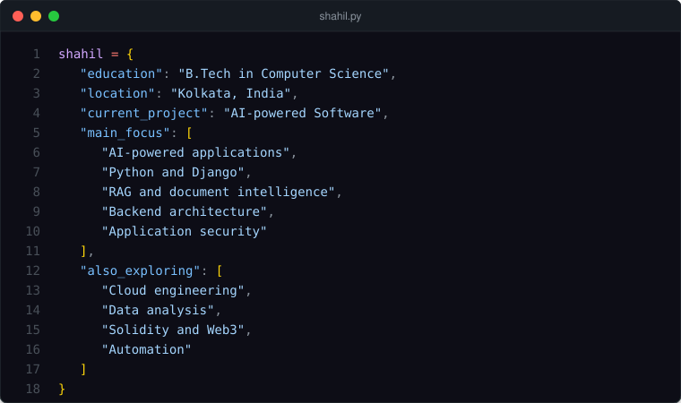

<!--
  GitHub Profile README
  Profile: github.com/ShahilRoy
-->

## 👤 About Me

I am a **B.Tech Computer Science student** at Brainware University, working across AI engineering, backend development, application security, data analysis, and blockchain.

I believe in learning by doing: building systems, finding security flaws, optimizing backend operations, and turning experimental ideas into reliable, production-ready applications.

 

  

 

 

## 🛠️ Currently Building

### 🔒 Private AI Document Intelligence Platform

I am currently developing a private AI-powered workspace focused on document understanding, information retrieval, research workflows, and intelligent automation.

The project is intentionally kept partially undisclosed while development is in progress.

**Key Development Areas:**

* 🔍 **Source-grounded AI conversations** — connecting generated answers with retrieved evidence and source material.
* 📄 **Large-document processing** — extracting, structuring, and analyzing complex files.
* 🧠 **Retrieval-Augmented Generation (RAG)** — experimenting with retrieval, ranking, context construction, and grounding.
* 🔒 **Data isolation & privacy** — maintaining strict boundaries between users, documents, and conversations.
* ⚡ **Background-processing pipelines** — handling computationally expensive workloads outside request-response paths.
* 💻 **AI workspace interfaces** — designing clean environments for reading, research, analysis, and interaction.
* 🛡️ **Secure multi-user architecture** — strengthening authentication, authorization, and access-control boundaries.
* 🌐 **Web-assisted information retrieval** — combining external information sources with AI reasoning pipelines.

 

*The goal is to explore how retrieval, document intelligence, AI reasoning, and reliable software architecture can work together inside a production-oriented system.*

  

 

 

## 💻 Technical Skills

### 🧠 Languages

  

 

### ⚙️ Backend & Systems

  

 

### 📊 Databases & Data

  

* 🐼 Pandas & Matplotlib
* 🧼 Data cleaning & analysis
* 📄 OCR & document extraction

 

### ⛓️ Blockchain & Web3

  

* 🛠️ Foundry (Forge, Cast, Anvil, Chisel)
* 📈 Chainlink Price Feeds & Chainlink VRF
* 📜 Solidity scripting & contract testing

 

### 🛠️ Tools & Platforms

  

* 🪟 Windows and WSL
* 🐳 Docker Desktop
* 🐙 Git and GitHub
* 🦙 Ollama (Local LLMs)
* 🔄 n8n automation
* 🌐 Web-search API integrations
* 🔌 REST APIs
* 🐚 PowerShell and Bash scripting

 

 

## 📂 Project Experience

### 🔒 Private AI Systems Project

`AI` · `Django` · `RAG` · `Document Processing` · `Information Retrieval` · `Web Search`

An ongoing private project exploring AI-powered document intelligence, retrieval systems, source-grounded generation, automation, and production-oriented backend architecture.

Certain implementation details and product information are intentionally not disclosed publicly.

 

### ⛓️ FoundryProject251

`Solidity` · `Foundry` · `Smart Contracts` · `Testing` · `Deployment`

A collection of Solidity projects developed while learning professional smart-contract workflows with Foundry.

👉 [View repository](https://github.com/ShahilRoy/FoundryProject251)

 

### 💳 FundMe Smart Contract

`Solidity` · `Chainlink` · `Forge Testing` · `Deployment Scripts`

A decentralized funding contract using Chainlink price feeds, automated deployment scripts and unit testing.

 

### 🎟️ Smart Contract Lottery

`Solidity` · `Chainlink VRF V2.5` · `Automation` · `Foundry`

A decentralized raffle system using verifiable randomness, mocks, network configuration and automated testing.

 

### ✍️ Handwriting-to-Text Application

`Python` · `Flask` · `OpenCV` · `Tesseract OCR` · `Pillow`

An OCR-based application for extracting digital text from handwritten or scanned images.

 

### 📊 Data Analysis Projects

`Python` · `Pandas` · `Matplotlib` · `SQL`

Data-cleaning, visualization and exploratory-analysis projects, including analysis of COVID-19 datasets.

 

### 🤖 Workflow Automation

`n8n` · `Gmail` · `Ollama` · `Docker` · `Local AI`

Experiments with AI-assisted email categorization and local automation using n8n, Gmail integrations and Ollama models.

 

 

## 📚 What I Am Learning

| Area                      | Current Focus                                                 |
| :------------------------ | :------------------------------------------------------------ |
| **AI Engineering**        | RAG, grounding, retrieval, reranking, and model orchestration |
| **Backend Development**   | Django architecture, APIs, and background jobs                |
| **Document Intelligence** | PDF parsing, OCR, indexing, retrieval, and citations          |
| **Security**              | Authentication, authorization, and data isolation             |
| **Cloud**                 | Deployment, monitoring, and scalable infrastructure           |
| **Frontend**              | Responsive AI workspaces and TypeScript                       |
| **Blockchain**            | Foundry, Solidity, and Chainlink integrations                 |
| **Data**                  | Python, SQL, and data visualization                           |

 

 

 

 

 

 

## 📊 GitHub Statistics

  
  &nbsp;&nbsp;
  

  

  

  

  

 

 

## 🎯 Current Direction

My current objective is to become capable of building complete real-world systems — from interface and backend architecture to AI integration, security, testing, deployment, and infrastructure.

I am particularly interested in projects involving:

`AI Systems` · `Document Intelligence` · `Information Retrieval` · `AI Automation` · `Secure Backends` · `Developer Tools` · `Open-Source`

  

  <h3>⚡ Build. Test. Understand. Improve. ⚡</h3>

